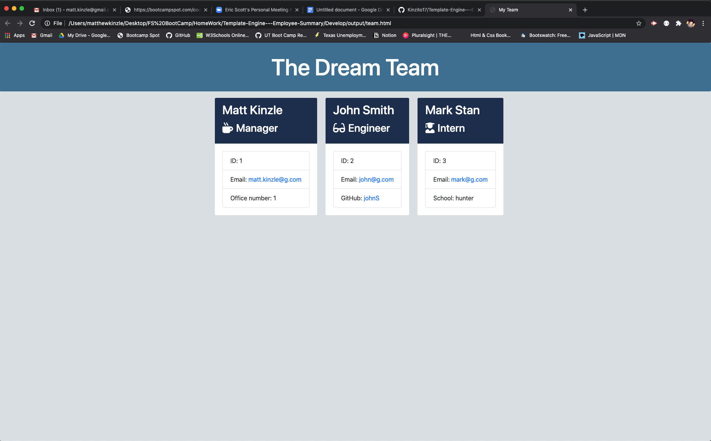
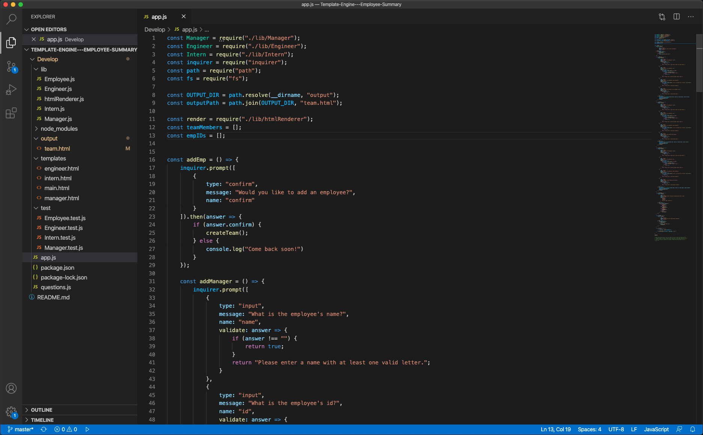

# Template-Engine---Employee-Summary

## About

The Employee Summary generator is a nodejs command line program. When a user runs the program they are prompted to answer questions about their employees. 

Their are three possible employee choices Manager, Engineer and Intern. Each selection will present questions that will be answered for all employees and a specific question based on the selection.

The answers are then passed in to an array to be rendered and written to an .html file. 

Please find the team.html file written from the program here ->./develop/output.team.html.

## Demo

[Click HERE for a video Demo](https://drive.google.com/file/d/1LXM452uTfYzKfCBLrptdTZjkw_w0kLrk/view?usp=sharing)

